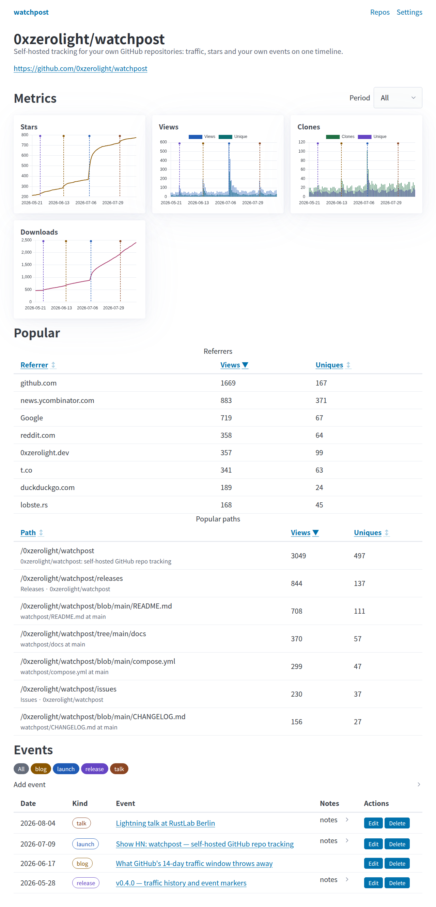

<h1 align="center">watchpost</h1>

<p align="center">
  <a href="https://www.gnu.org/licenses/agpl-3.0"></a>
  <a href="https://www.rust-lang.org/"></a>
  <a href="https://github.com/0xzerolight/watchpost/releases"></a>
  <a href="https://github.com/0xzerolight/watchpost/stargazers"></a>
</p>

<p align="center">
Self-hosted GitHub repo metrics that outlive GitHub's 14-day traffic window.
</p>

<p align="center">
Please leave a ⭐ star if watchpost is useful - it helps others find it :).
</p>

<h3 align="center">Demo</h3>

<p align="center">
  
</p>

<p align="center">
One page per repo - the metrics on top, the events that caused them marked on every chart.
</p>

GitHub throws your traffic data away after 14 days. watchpost samples it hourly into a local SQLite file and keeps it, next to a timeline of what you did to earn it: post a release to Hacker News, add it as an event, and the spike lands under a marker instead of being a spike you no longer remember the cause of. It talks to nothing but the GitHub API.

## Install

### 1. Install Docker

watchpost runs in Docker. Get it at [get.docker.com](https://get.docker.com), or install [Docker Desktop](https://www.docker.com/products/docker-desktop/) on macOS/Windows. Make sure it's running before you continue.

### 2. Create a GitHub token

Create a [fine-grained personal access token](https://github.com/settings/personal-access-tokens/new) and grant these **Repository permissions**:

| Permission | What it buys you |
|------------|------------------|
| **Metadata: read** | The repository list and the basic counts. Selected for you, cannot be removed |
| **Administration: read** | Traffic - views, clones, referrers, popular paths |
| **Contents: read** | Releases and asset download counts |
| **Pull requests: read** | The open pull request count |

A classic token with the `repo` scope also works. A missing permission only costs that one part of a sync, not the whole sync - without *Administration: read* the traffic charts stay empty while everything else still lands. Traffic is only served for repositories you own or administer, whatever the token says.

### 3. Run watchpost

```bash
git clone https://github.com/0xzerolight/watchpost.git
cd watchpost
cp .env.example .env    # paste your token into WATCHPOST_GITHUB_TOKEN
mkdir -p data
docker compose up -d
```

Open [http://127.0.0.1:8080](http://127.0.0.1:8080) and pick which repositories to track on the **Settings** page - nothing is tracked until you say so. The first sync runs at startup, so the list fills in within a minute.

The container runs as uid 1000. If your host user has a different uid, `chown -R <uid> data` after creating the directory, or the database cannot be created.

<details>
<summary><strong>Build from source (no Docker)</strong></summary>

Rust 1.88 or newer, no system dependencies beyond a C toolchain - SQLite is compiled in.

```bash
git clone https://github.com/0xzerolight/watchpost.git
cd watchpost
cp .env.example .env    # paste your token into WATCHPOST_GITHUB_TOKEN
cargo build --release
./target/release/watchpost
```

The release profile uses fat LTO and a single codegen unit, so the first build takes a couple of minutes.

</details>

<details>
<summary><strong>Updating</strong></summary>

```bash
cd watchpost
git pull
docker compose up -d --build
```

The database is backed up automatically before any schema migration, and the newest three backups are kept.

</details>

<details>
<summary><strong>Configuration</strong></summary>

All settings are environment variables, read from `.env` by compose. See [`.env.example`](.env.example).

| Variable | Default | Meaning |
| --- | --- | --- |
| `WATCHPOST_GITHUB_TOKEN` | *(required)* | Token used for every API call |
| `WATCHPOST_CRON` | `0 5 * * * *` | Collection schedule, six fields (seconds first), UTC. An unparseable value falls back to the default |
| `WATCHPOST_DB_PATH` | `./data/watchpost.db` | SQLite file. `/app/data/watchpost.db` in the image |
| `WATCHPOST_HOST` | `127.0.0.1` | Bind address. The image sets `0.0.0.0` |
| `WATCHPOST_PORT` | `8080` | Bind port |
| `WATCHPOST_LOG` | `info` | `tracing` filter, e.g. `watchpost=debug` |
| `WATCHPOST_GITHUB_API_BASE` | `https://api.github.com` | Override for GitHub Enterprise. Must be `http`/`https`; a missing trailing slash is added |
| `WATCHPOST_TZ` | `UTC` | IANA zone name (e.g. `Europe/Madrid`) the UI displays times in. An unknown name is a startup error, not a silent fall back to UTC |

</details>

## Features

- **Outlives the 14-day window** - views, clones, referrers and popular paths sampled hourly and kept forever, long after GitHub has forgotten them
- **Promo event timeline** - add a post, a talk or a release announcement and it renders as a marker on every chart for that repo, so spikes have causes
- **Stars, forks, watchers, issues and open PRs** sampled daily, with star history backfilled from the stargazers API on the first sync
- **Release asset download counts** per tag
- **One SQLite file, one static binary** - no database server, no CDN, no JavaScript build step. Outbound traffic goes to the GitHub API and nowhere else
- **Instant period switching** - 7, 30, 90, 365 days or all time. The whole history ships with the page, so zooming never hits the server
- **Honest numbers** - missing days render as gaps rather than invented zeros, and uniques are never summed across days

<details>
<summary><strong>More features</strong></summary>

- Sortable all-time referrer and popular-path tables
- Freeform event kinds with markdown notes, each kind auto-assigned a colour shared by its badge and its chart markers
- Manual **Sync now** with a live status banner, plus per-repo error and backoff state on the Settings page
- Dark mode following your OS, reduced-motion support, and WCAG AA contrast throughout
- `watchpost --doctor` prints a secret-safe diagnostic snapshot - config, schema version, row counts, rate-limit budget and per-repo sync state
- Pre-migration database backups taken through SQLite's own backup API, so they are consistent even mid-write

</details>

<details>
<summary><strong>How It Works</strong></summary>

1. Every hour, and once at startup, watchpost calls the GitHub API for each tracked repository.
2. Results are written to a local SQLite file, one row per repo per UTC day. Writes are idempotent, so a repeated pass overwrites rather than double-counts.
3. Traffic days GitHub is about to forget are already stored, so history accumulates past the 14-day window.
4. Your events are drawn as vertical markers on every chart for that repo, lining spikes up with whatever caused them.

More detail, and the caveats worth knowing before you draw conclusions from the numbers, in [ARCHITECTURE.md](ARCHITECTURE.md).

</details>

## Security

**No built-in authentication** by design (single-user tool). Anyone who can reach the port gets the whole app, including write access to your events and the sync button. Both defaults keep it private: `WATCHPOST_HOST` is `127.0.0.1` and `compose.yml` publishes to `127.0.0.1:8080` only. For remote access, put it behind a reverse proxy that does the authenticating ([Authelia](https://www.authelia.com/), [Authentik](https://goauthentik.io/), Caddy `basicauth`) and forward `X-Forwarded-Proto: https`. See [SECURITY.md](SECURITY.md).

## Troubleshooting

| Issue | Fix |
|-------|-----|
| **No repositories listed** | Open **Settings**, press **Refresh from GitHub**, tick the repos you want and **Save**. Nothing is tracked by default. |
| **Views and clones charts are empty** | The token is missing *Administration: read*, or the repo is not one you own or administer. `--doctor` shows the per-repo last error. |
| **Container exits, or "unable to open database"** | `data/` is not writable by uid 1000. `chown -R 1000:1000 data`. |
| **Syncs stop and nothing updates** | You are rate limited. `--doctor` prints the remaining budget and the reset time. Collection resumes on its own. |
| **"database was written by a newer build"** | You downgraded. Reinstall the newer version, or restore one of the `data/watchpost.v*.bak` files. |
| **Startup fails with a timezone error** | `WATCHPOST_TZ` must be an IANA zone name such as `Europe/Madrid`, not an abbreviation or an offset. |
| **Times look shifted** | Displayed timestamps follow `WATCHPOST_TZ`, but day buckets are always UTC - GitHub returns traffic already summed per UTC day and those buckets cannot be re-cut. |

Still stuck? Run `docker compose exec watchpost watchpost --doctor` for a secret-safe diagnostic snapshot - effective config (the token as last-4 and length only), database path, schema version, row counts, rate-limit budget and per-repo sync state - and paste it into a bug report. Logs: `docker compose logs -f`.

## Contributing

Contributions of any kind are welcome.

- New here? Start with [CONTRIBUTING.md](CONTRIBUTING.md).
- Architecture overview: [ARCHITECTURE.md](ARCHITECTURE.md).
- Security: [SECURITY.md](SECURITY.md).

Bug reports and feature requests -> [Issues](https://github.com/0xzerolight/watchpost/issues).
Questions and discussion -> [Discussions](https://github.com/0xzerolight/watchpost/discussions).

## License

GNU Affero General Public License v3.0 or later. See [LICENSE](LICENSE).

Copyright © 2026 0xzerolight.
